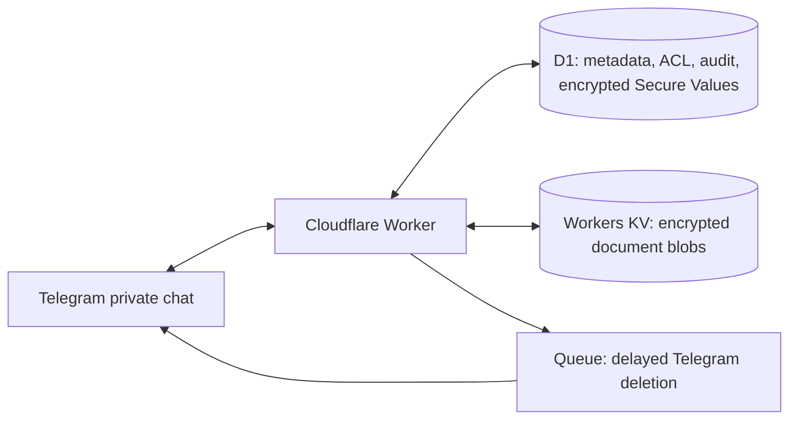

# Vaultgram

Vaultgram is a private Telegram bot for encrypted document storage and small Secure Values. Each installation runs in the deployer's Cloudflare account. There is no Vaultgram hosted account, web dashboard, or external storage provider.

**[راهنمای فارسی نصب](docs/INSTALL.fa.md)**

The bot's main upload, retrieval, PIN, access-control, protected-delivery, and timed-deletion flow has been validated against a live deployment. The fresh-install wizard has passed automated checks and Wrangler dry runs; its first independent installation is still pending.

## What it does

- Keeps encrypted documents in Cloudflare KV and encrypted Secure Values in D1.
- Lets an Owner create Vaults and Categories, then grant each member `VIEW`, `EDIT`, or `MANAGE` access per Vault.
- Requires a member PIN at onboarding and supports configurable PIN checks before retrieval.
- Protects delivered Telegram messages from forwarding and schedules their deletion.
- Uses single-use, expiring invitations. The bot runs in private chats only.

## Architecture



Documents are encrypted with AES-256-GCM before KV storage. Each version uses a new opaque KV key. Secure Values are encrypted in D1; their labels remain visible to authorized users. The master key is a Worker Secret. Both encryption modes derive separate per-record keys with HKDF and bind ciphertext to its record with authenticated data. A 20 MB file limit stays below Telegram's hosted Bot API download limit and KV's 25 MiB value limit. KV's free tier has a 1 GB storage quota and daily operation limits; see [Cloudflare KV limits](https://developers.cloudflare.com/kv/platform/limits/). KV is eventually consistent across locations, so a newly uploaded file may take a short time to become readable elsewhere. Retry retrieval if the bot reports propagation.

## Requirements

- A Telegram account and a bot created with [BotFather](https://t.me/BotFather)
- A Cloudflare account with Workers, D1, KV, and Queues available
- Node.js 20 or newer and npm

No Microsoft, Google, payment card, or separate storage account is needed for the default installation.

## Quick install

1. Create a **new** bot with [BotFather](https://t.me/BotFather) and keep its token private. Have a Cloudflare account ready.
2. Clone this repository and run `npm run setup` in its directory:

   ```bash
   git clone https://github.com/imehdiha/vaultgram.git
   cd vaultgram
   npm run setup
   ```

   The wizard installs dependencies, opens Cloudflare login if needed, accepts the bot token without echoing it, creates one private recovery file, deploys isolated resources, sets Worker Secrets, applies D1 migrations, checks health, and configures Telegram. It refuses a bot that already has a webhook and can resume an interrupted installation using its original secrets.
3. Save the recovery file in a password manager when prompted. It is outside the repository and readable only by your local account. **Loss of `VAULT_ENCRYPTION_KEY` makes encrypted documents and Secure Values unrecoverable.** After installation finishes and your backup is verified, remove the local copy if you do not need it.
4. Open your new bot in a private chat. Send `/claim` followed by the `BOOTSTRAP_SECRET` from your recovery file. The first successful claim creates the sole Owner. The bot attempts to delete the claim message.
5. Create a Vault, Category, and document. Under **Members**, invite another Telegram account and grant it a specific Vault permission.

The wizard is for fresh installs. It creates a unique Worker, D1 database, KV namespace, and Queue for that bot. Its local Wrangler config and resume state stay under ignored `.vaultgram/`; it does not rewrite the public `wrangler.jsonc`. Run `npm run setup -- --dry-run` to see the sequence without changing anything. For manual installation or an existing deployment, see [manual installation](docs/MANUAL_INSTALL.md). A fresh wizard installation can be updated with `npx wrangler deploy --config .vaultgram/wrangler.jsonc` followed by `npx wrangler d1 migrations apply VAULTGRAM_DB --remote --config .vaultgram/wrangler.jsonc`.

If setup stops, read its last error and run `npm run setup` again after fixing the cause. It resumes with the same recovery file and does not rotate the encryption key. If it reports an existing webhook, use a new BotFather bot; the wizard will not take over a bot already in use. For questions or installation feedback, open a GitHub issue without including tokens, recovery files, personal IDs, or document contents.

For local development, copy `.dev.vars.example` to `.dev.vars`, fill local secrets, run `npm run db:migrate:local` and `npm run dev`. `.dev.vars` is ignored by Git. A public HTTPS tunnel is needed to receive real Telegram webhooks locally.

## Permissions and Telegram behavior

A Vault can represent a person, family, property, or organization. Its **Documents** view contains Categories and files; **Information** contains arbitrary labeled Secure Values. `VIEW` can browse and retrieve; tapping a document directly starts PIN unlock and retrieval. `EDIT` can upload, replace, and edit; `MANAGE` can archive, delete, and manage categories. The Owner manages members, grants, and settings. Every document and Secure Value operation checks the current Vault permission server-side, including old Telegram buttons. Invites are single-use, hashed in D1, and grant no Vault access until the Owner assigns it. A joining member's language is saved with the account and stays the same after PIN setup.

Delivered documents and Secure Values use Telegram `protect_content` by default and are queued for deletion after 120 seconds by default. The same setting controls both. Plaintext messages used to enter Secure Values are deleted after successful encrypted storage; if Telegram refuses deletion, the bot asks the user to delete them manually. Telegram may retain data under its own policies; auto-deletion is chat cleanup, not guaranteed erasure. A PIN policy can require an unlock for retrieval or other actions. English and Persian menus are supported.

The bot keeps one current navigation menu. Invites are separate messages with an explicit clickable URL and open/copy buttons, so creating one does not replace the Owner's menu. It attempts to delete old menus and incoming text, removes answered prompts, and queues other temporary bot messages, including invites, for deletion after two minutes. Older messages sent before this cleanup behavior was deployed may need to be removed manually in Telegram.

Archived documents and Secure Values can be restored or permanently deleted. Storage cleanup failures are recorded for **Settings → Reconcile storage**. KV object names are opaque and never shown in Telegram.

## Maintenance

Run `npm run verify` for type checking, lint, focused Workers tests, and a deployment dry run. Remote D1 schema changes require `npm run db:migrate:remote`; they are not applied during requests. Back up both D1 and KV data along with the master key before account or resource migration. Do not rotate the master key in place without re-encrypting existing data.

If the bot does not respond, check `npm run webhook:status`, the Worker health endpoint, D1 migrations, and Worker secrets. If retrieval reports propagation, retry shortly. If a file remains missing, the Owner can run storage reconciliation. The hosted Telegram Bot API limits downloads to 20 MB; the default file limit is 20,000,000 bytes. See [SECURITY.md](SECURITY.md) for security boundaries.
